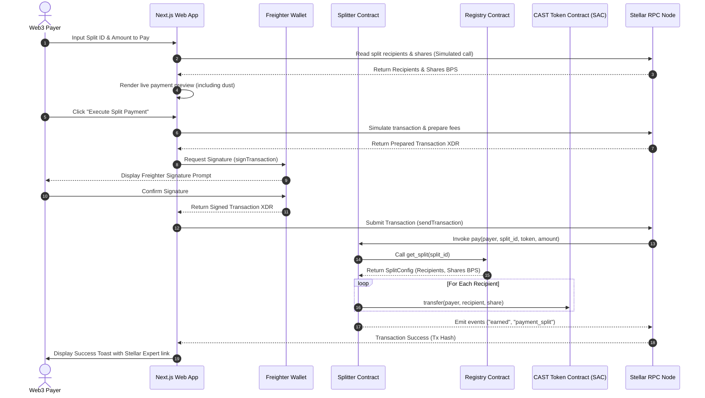

# SplitCast


*   **Live Demo:** [https://splitcast.pages.dev](https://splitcast.pages.dev)
*   **Demo Video (1–2 min):** `PENDING (Manual record required by user)`

---

## Project Description
SplitCast is a production-grade decentralized revenue and royalty-split router deployed on the **Stellar Testnet** using **Soroban smart contracts**. Anyone can define a named split configuration (artist, developer, pools — up to 10 recipients with preset percentages), and a single incoming payment automatically splits and fans out to all recipients atomically in one transaction, featuring a live per-collaborator earnings feed.

---

## Architecture
The interaction flow between the Freighter wallet, Next.js frontend, registry contract, splitter, and the Stellar Asset Contract (SAC) is detailed in the sequence diagram below:



---

## Tech Stack
*   **Smart Contracts**: Rust, Soroban SDK (v22.0.1)
*   **Frontend Framework**: Next.js 15 (App Router), React 19, TypeScript
*   **Styling**: Tailwind CSS (v4), Vanilla CSS variables
*   **Stellar Integration**: `@stellar/stellar-sdk` (v16.0.1) and `@stellar/freighter-api` (v6.0.1)
*   **State & Polling**: SWR-like custom event indexer polling
*   **Testing Suite**: Cargo test (Contracts), Vitest (Frontend pure math logic)

---

## Smart Contracts (Testnet)
| Contract / Token | Deployed Address (WASM Contract ID) | Stellar Expert Explorer Link |
| :--- | :--- | :--- |
| **Split Registry** | `CCC22LXGZF5B7G533QQQEFV4LDHGPJFT3LQUNQZEBNOAHMVNEHLZU2UV` | [Registry Explorer](https://stellar.expert/explorer/testnet/contract/CCC22LXGZF5B7G533QQQEFV4LDHGPJFT3LQUNQZEBNOAHMVNEHLZU2UV) |
| **Splitter Router** | `CBS77MAGACFL77PWVUE2L5I6Y7EV2GLZFYA6RJO2TUBPDNB5UBJCKZO6` | [Splitter Explorer](https://stellar.expert/explorer/testnet/contract/CBS77MAGACFL77PWVUE2L5I6Y7EV2GLZFYA6RJO2TUBPDNB5UBJCKZO6) |
| **CAST SAC Token** | `CC5OC6ZCPMTOHHTSWO2SQVTQUTC3S2PTS33M34CMJ3GN7CV64RP4Y2CK` | [CAST Token Explorer](https://stellar.expert/explorer/testnet/contract/CC5OC6ZCPMTOHHTSWO2SQVTQUTC3S2PTS33M34CMJ3GN7CV64RP4Y2CK) |

---

## Inter-Contract Calls
The payment `splitter` contract makes direct, synchronous cross-contract calls to the `split_registry` to retrieve split recipient configurations during execution. This represents a genuine on-chain dependency link.
*   **Function Invoked**: `RegistryClient::new(env, &registry).get_split(&split_id)`
*   **Testnet Execution Evidence**: Transaction [ff6df9f5d22eda63b540624a400838e49debb77e785493b94018045066f806e1](https://stellar.expert/explorer/testnet/tx/ff6df9f5d22eda63b540624a400838e49debb77e785493b94018045066f806e1)

---

## Wallet Connection
SplitCast integrates with the **Freighter Wallet** browser extension to establish a secure link:
1. Checks freighter presence using `isConnected()` from `@stellar/freighter-api`.
2. Requests the user's active public key using `getAddress()`.
3. Displays active native XLM balances and custom `CAST` token balances polled from Horizon Testnet.
4. If a connected account has not yet established a trustline for `CAST`, a warning badge is displayed with a one-click button to execute `ChangeTrust` via Freighter.

---

## Core Mechanics

### Rounding Dust Allocation
Integer division can leave a minor dust residue when dividing odd amounts among multiple recipients.
To ensure the exact input payment amount is fully routed, SplitCast implements a rounding dust reallocation mechanism:
1. The contract calculates each recipient's share using standard basis points: `share = (amount * bps) / 10000`.
2. It aggregates all divided shares.
3. The remaining difference (the rounding dust) is added directly to the **last recipient**'s payout: `last_recipient_share = amount - total_previously_allocated`.

### Bounded Storage
To optimize gas costs and prevent ledger bloat, SplitCast does not save payment history records in contract storage. Instead, it relies on ledger event emissions. Every state change publishes an event:
*   `earned(split_id, recipient, amount)`
*   `payment_split(split_id, payer, token, amount, recipients, shares)`

The frontend monitors these events to dynamically reconstruct running activity feeds and user dashboard totals.

---

## Error Handling
SplitCast implements clear, distinct user-facing messaging for the following edge cases:
*   **SharesDoNotSumTo10000**: The registry contract reverts if percentage basis points do not total exactly 100.00% (10,000). The frontend locks the submit button until this condition is met.
*   **RecipientsAndSharesMismatch**: Reverts if recipients and shares input lengths differ.
*   **Missing Trustline**: Reverts when transferring SAC tokens to accounts that haven't established trust. Frontend detects this and alerts the recipient.
*   **Insufficient Balance**: Reverts if the payer does not have enough CAST tokens.
*   **Signature Rejected**: Catch block detects Freighter UI reject actions, alerts the user, and preserves form inputs.

---

## Screenshots
*   *Mock locations — User should place real PNG captures here before final git commit:*
    - Connect Wallet: `assets/connected_state.png`
    - Create Split: `assets/create_split.png`
    - Live Preview: `assets/live_preview.png`
    - Dashboard Tickers: `assets/dashboard_tickers.png`

---

## Setup Instructions

### Prerequisites
*   [Rust & Cargo](https://rustup.rs/) (v1.80+)
*   [Stellar CLI](https://developers.stellar.org/docs/tools/developer-tools/cli) (v21.0+)
*   [Node.js](https://nodejs.org/) (v20+)

### Building Contracts
```bash
cargo build --target wasm32-unknown-unknown --release
```

### Running Frontend Locally
1. Navigate to the frontend directory:
   ```bash
   cd frontend
   ```
2. Install dependencies:
   ```bash
   npm install
   ```
3. Run dev server:
   ```bash
   npm run dev
   ```
4. Access app at `http://localhost:3000`.

---

## Testing

### Smart Contract Tests
Run 19 Rust contract unit tests verifying basis points, resizing lists, single-recipient splits, dust math, and errors:
```bash
cargo test
```

### Frontend Logic Tests
Run 7 Vitest unit tests verifying share divisions, percentage sums, and currency formatting:
```bash
cd frontend
npm test
```

---

## License
MIT License.
